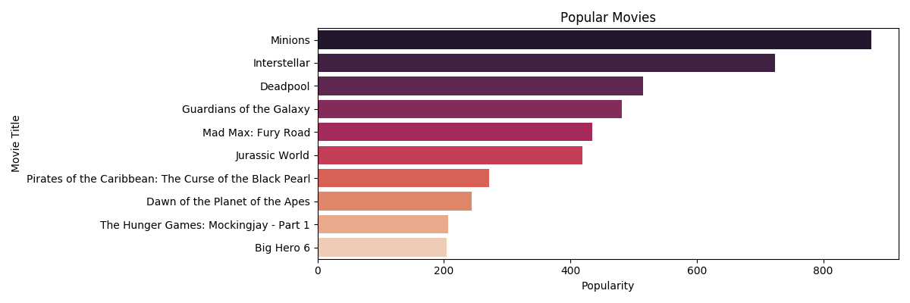

## Introduction
Recommendation systems are used everywhere in today's day and age as a part of online advertising. Some simple 
examples can be friend recommendations on facebook, recommendation of similar items in shopping websites, ads in 
Instagram and movie recommendations in netflix etc. Data plays a key role in building relevant systems in all the
above areas. This is a simple project which experiments on movie recommendation techniques using python data processing 
packages.

## Data
The dataset has been obtained from https://www.kaggle.com/tmdb/tmdb-movie-metadata#tmdb_5000_movies.csv. 
It mainly consists of the following columns:
- budget
- genres
- homepage
- id
- keywords
- original_language
- original_title
- overview
- popularity
- production_companies
- production_countries
- release_date
- revenue
- runtime
- spoken_languages
- status
- tagline
- title
- vote_average
- vote_count

## Methods:
Two methods have been used in order to generate recommendations.

1. Popularity based
2. Content based

### Recommendation based on Popularity
The following code is used to get a list of popular movies:
```
popular = movie_data.sort_values('popularity', ascending=False)
plt.figure(figsize=(12, 4))

ax = sns.barplot(x=popular['popularity'].head(10), y=popular['original_title'].head(10), data=popular, palette="rocket")
plt.xlabel("Popularity")
plt.ylabel("Movie Title")
plt.title("Popular Movies")
fig1 = plt.gcf()
plt.show()
plt.draw()
fig1.savefig('popular_movies.png')
```
#### Result:
Here is the output showing the most popular movies:


### Recommendation based on Content
The image below shows how the content based system works


Simple explanation of how the cosine similarity function works


The similarity matrix for the vectors in the above image is 
```
[[1, 0.8]
 [0.8, 1]]
```

The following code is used to produce the output based on content:
```
# Content Based Filtering
movie_data['overview'] = movie_data['overview'].fillna('')

# Remove the words such as "a", "an", "the"
tfidf = TfidfVectorizer(stop_words='english')
tfidf_matrix = tfidf.fit_transform(movie_data['overview'])
tfidf_matrix.shape
```
matrix_shape is (4803, 20978)
```
cosine_sim_matrix = linear_kernel(tfidf_matrix, tfidf_matrix)
indices = pd.Series(movie_data.index, index=movie_data['original_title']).drop_duplicates()
def get_content_based_movie_recommendations(title, cosine_sim=cosine_sim_matrix):
    """ Takes the title of the movie and returns the list of recommended movies
    :param title: Movie title
    :param cosine_sim: Cosine similarity matrix
    :return: List of five similar movies
    """
    movie_index = indices[title]
    similarity_scores = list(enumerate(cosine_sim[movie_index]))
    similarity_scores = sorted(similarity_scores, key=lambda x: x[1], reverse=True)
    similarity_scores = similarity_scores[1:6]
    movie_indices = [i[0] for i in similarity_scores]
    return movie_data['original_title'].iloc[movie_indices]


def get_multiple_movie_recommendations_list(movie_titles):
    """ Gets the recommended movies for each title in the list
    :param movie_titles: List of movies
    :return: Recommended movie list
    """
    final_movie_list = []
    for movie_title in movie_titles:
        final_movie_list.extend(get_content_based_movie_recommendations(movie_title))
    return final_movie_list

final_movie_list = get_multiple_movie_recommendations_list(['Spy Kids', 'Avatar'])
get_multiple_movie_recommendations_list(['Spy Kids', 'Avatar'])
```

#### Result:
- The following output recommendations are obtained for the movies **Spy Kids** and **Avatar**
- The results can also be seen in the file ```results/recommended_movie_data_file.html```

|Index|Movie Title|
|--- |--- |
|1|Spy Kids 2: The Island of Lost Dreams|
|2|Spy Kids 3-D: Game Over|
|3|Go for It!|
|4|Jimmy Neutron: Boy Genius|
|5|Spy Kids: All the Time in the World|
|6|Apollo 18|
|7|The American|
|8|The Matrix|
|9|Obitaemyy Ostrov|
|10|Tears of the Sun|

## Conclusion
While this recommendation system works for a simple data set it is 
a good idea to implement a hybrid recommendation system which is a 
mix of content based and collaborative systems for better results.

## Setup

Download the project or clone it using 
```
git clone https://github.com/kavya-yerrabandi/MovieRecommendationSystem
```
- Open terminal and type
```
cd <path_to_project>/MovieRecommendationSystem
```
- Run the following command from the project folder to install requirements
```
pip3 install -r requirements.txt
```
- Run the **movie_recommendation_system.py** file to obtain the results and the files generated can be
viewed in the **results** folder

## References
- https://medium.com/code-heroku/building-a-movie-recommendation-engine-in-python-using-scikit-learn-c7489d7cb145
- https://www.kaggle.com/tmdb/tmdb-movie-metadata
- https://matplotlib.org/api/_as_gen/matplotlib.pyplot.barh.html
